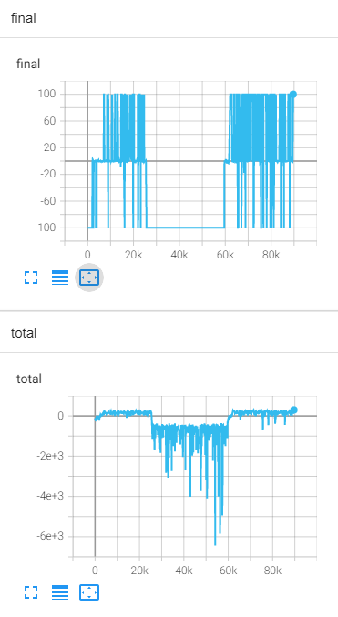

# rl_code
It's a reinforce learning for gym, now is playing LunarLander-v2 game

# result

the policy grdient result is like:

***

the ppo result is like:

# 一些分析
对于a2c来说，learning rate不能过大，在小learning rate情况下表现稳定，如下图：

对于ac来说，参数仍需要调整，在后期会有崩溃情况出现，在使用mc算reward时，会有崩溃现象发生，如下图：
